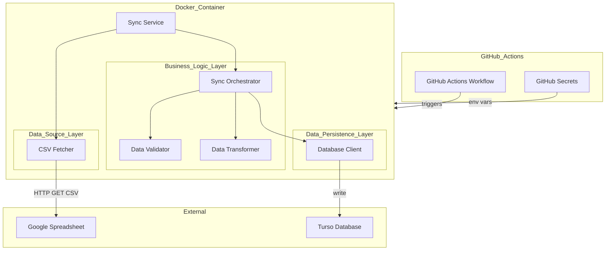
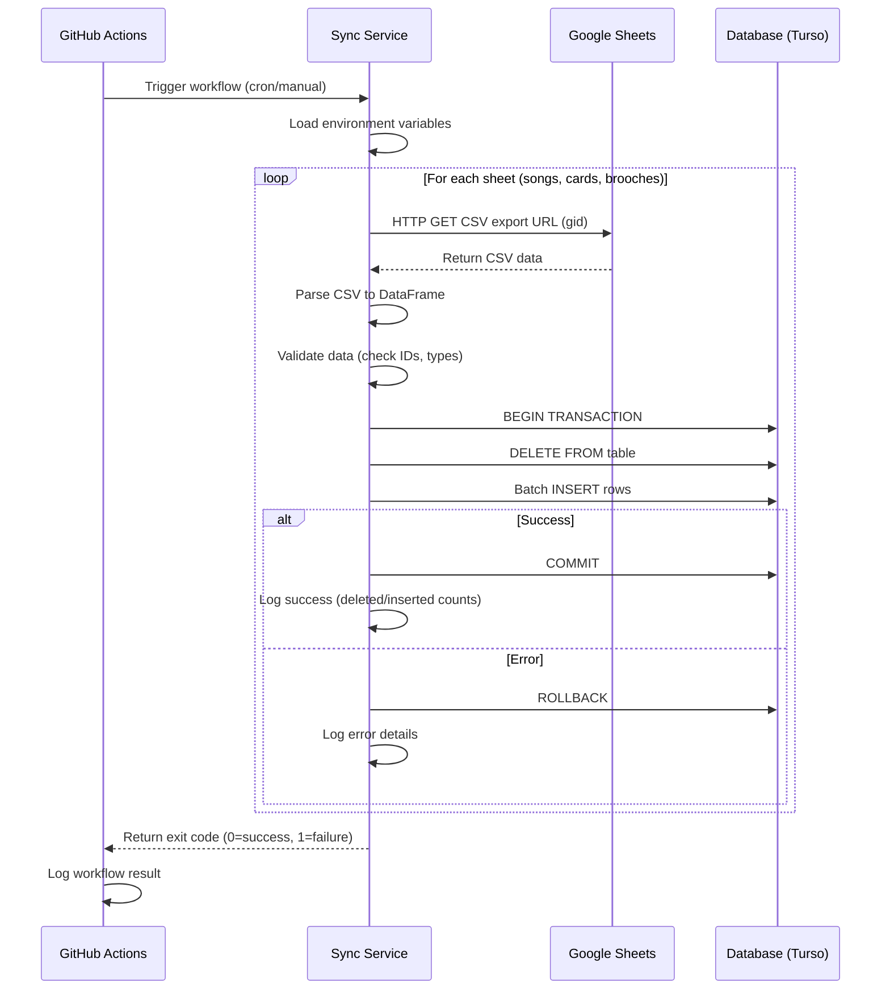
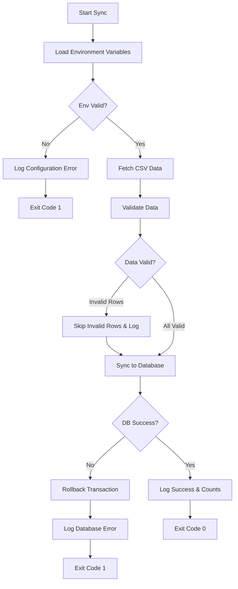
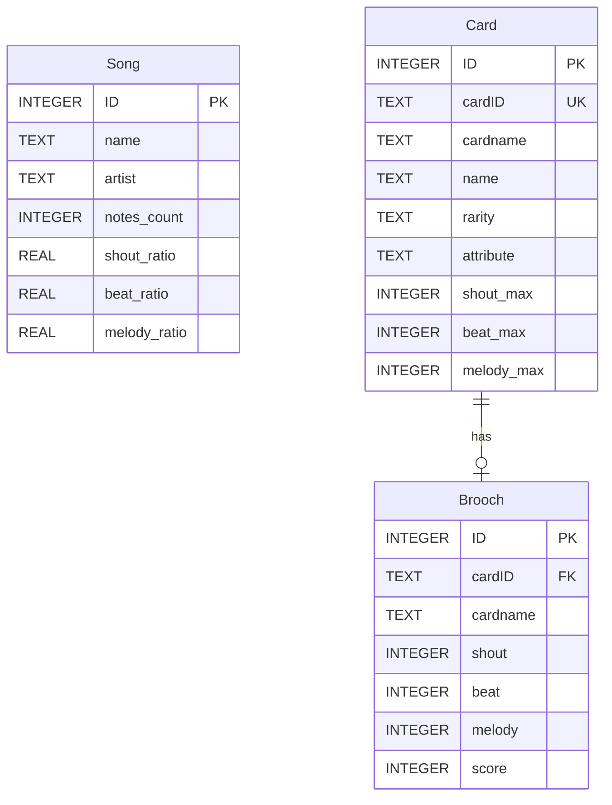

# Design Document

---
**Purpose**: Google Spreadsheet同期システムの技術設計を提供し、異なる実装者間での実装の一貫性を確保する

**Approach**:
- 実装判断に直接影響する本質的なセクションを含む
- 機能の複雑さに応じた詳細レベルを適用
- 冗長な文章よりも図表を使用
- 重要な場合を除き、オプションセクションは省略

**Warning**: 1000行に近づくことは、設計の簡素化が必要な過度の機能複雑性を示す
---

## Overview

本機能は、Google Spreadsheetに格納されたアイドリッシュセブンのゲームデータ（楽曲、カード、固有ブローチ）を定期的にデータベースに同期するGitHub Actions自動化ワークフローを提供する。

**Purpose**: システム管理者と開発者に対して、手動介入なしで常に最新のゲームデータをデータベースに維持する機能を提供する。

**Users**:
- システム管理者: GitHub Actionsワークフローの設定と監視
- 開発者: ローカルDocker環境でのテストと開発
- データ利用者: 同期されたデータベースを使用したスコア計算アプリケーション

**Impact**: 現在のシステムを新規構築し、以下の変更を実現する：
- Google Spreadsheetからの自動データ取得
- 3つのテーブル（songs、cards、brooches）への構造化データ保存
- 1時間ごとの自動同期実行
- 開発環境（Docker）と本番環境（GitHub Actions）の両方でTursoデータベースを使用

### Goals

- Google Spreadsheetから3種類のゲームデータを自動取得する
- 取得したデータを3つのデータベーステーブルに確実に同期する
- GitHub Actionsで1時間ごとに自動実行する
- Docker環境と本番環境の両方でTursoデータベースを使用し、環境の一貫性を確保する
- エラーハンドリングとログ記録により、問題の迅速な検知と対応を可能にする
- シンプルで確実な同期処理（全削除→全挿入）を実装する

### Non-Goals

- Spreadsheetデータの編集機能（読み取り専用）
- リアルタイム同期（1時間ごとのバッチ同期のみ）
- 差分検知による増分同期（全削除→全挿入で実装）
- Webインターフェースやダッシュボード
- スコア計算ロジックの実装（別システムで実装予定）
- 複数のSpreadsheetソースへの対応（単一Spreadsheetのみ）
- SQLiteの使用（開発環境と本番環境の両方でTursoを使用）

## Architecture

### Existing Architecture Analysis

本プロジェクトは新規構築のため、既存アーキテクチャは存在しない。ただし、以下の制約を考慮する：
- GitHub Actionsの実行時間制限（最大6時間、実用的には30分以内を目標）
- Tursoの接続数制限とレート制限
- Google SpreadsheetsのCSVエクスポートURL（公開アクセス可能なSpreadsheet）

### Architecture Pattern & Boundary Map

**Selected Pattern**: Layered Architecture（階層型アーキテクチャ）

本システムは、以下の3層で構成される：
1. **Data Source Layer**: Google SpreadsheetsのCSVエクスポートからのデータ取得
2. **Business Logic Layer**: データ検証、変換、同期ロジック
3. **Data Persistence Layer**: Tursoへのデータ保存



**Architecture Integration**:
- 選定パターン: Layered Architecture — テスト容易性と責任分離を重視
- ドメイン/機能境界: データ取得、ビジネスロジック、永続化の3層分離により、各層の独立したテストとメンテナンスを実現
- 既存パターン保持: 新規構築のため該当なし
- 新コンポーネント根拠: 各層のコンポーネントは単一責任原則に従い、テストとメンテナンスの容易性を確保
- Steering準拠: シンプルさとメンテナンス性を重視する設計原則に従う

### Technology Stack

| Layer | Choice / Version | Role in Feature | Notes |
|-------|------------------|-----------------|-------|
| Runtime | Python 3.11+ | メインプログラミング言語 | 型ヒントとパフォーマンスが向上 |
| Data Access | pandas 2.0+ | CSVデータ読み込みと処理 | read_csv()で直接CSVから読み込み |
| HTTP Client | requests 2.31+ | CSV URLからのデータ取得 | シンプルで信頼性の高いHTTPクライアント |
| Database Client | libsql-client 0.4+ | Turso接続とクエリ実行 | Turso公式SDK、libSQL（SQLite互換） |
| Container | Docker 24+ / docker-compose 2.0+ | 開発環境と実行環境の一貫性 | 環境再現性確保 |
| CI/CD | GitHub Actions | スケジュール実行と自動化 | 1時間ごとのcron実行 |
| Database | Turso (libSQL) | 開発環境・本番環境共通DB | スケーラブル、SQLite互換、環境統一 |
| Secrets Management | GitHub Secrets / .env | 機密情報管理 | 本番はSecrets、開発は.env |

詳細な技術選定根拠と比較は`research.md`を参照。

## System Flows

### 同期処理フロー



**Key Decisions**:
- 各テーブルごとに個別トランザクション実行（部分的な失敗でも他テーブルは継続）
- バッチ挿入でパフォーマンス最適化
- エラー時はロールバックで一貫性保証

### エラーハンドリングフロー



**Key Decisions**:
- CSV取得失敗時は最大3回リトライ（ネットワークエラー対策）
- データ検証エラーは該当行をスキップし、エラーログ記録
- データベースエラーは即座にロールバックし、詳細ログ記録

## Requirements Traceability

| Requirement | Summary | Components | Interfaces | Flows |
|-------------|---------|------------|------------|-------|
| 1 | Google Spreadsheetデータ取得 | CSVFetcher | CSVDataSource | 同期処理フロー |
| 2 | データベーススキーマ管理 | DatabaseClient, SchemaManager | DatabaseInterface | - |
| 3 | データ同期処理 | SyncOrchestrator, DataTransformer | SyncService | 同期処理フロー |
| 4 | GitHub Actions スケジュール実行 | GitHub Actions Workflow | - | - |
| 5 | Docker開発環境 | docker-compose.yml, Dockerfile | - | - |
| 6 | 本番環境 Turso対応 | DatabaseClient | DatabaseInterface | - |
| 7 | エラーハンドリングとログ記録 | ErrorHandler, Logger | - | エラーハンドリングフロー |
| 8 | データ検証 | DataValidator | ValidationService | 同期処理フロー |
| 9 | パフォーマンスと効率性 | BatchInserter | DatabaseInterface | 同期処理フロー |
| 10 | セキュリティとアクセス制御 | AuthenticationManager | - | 同期処理フロー |
| 11 | テスト容易性 | All Components | All Interfaces | - |
| 12 | ドキュメンテーション | README.md, SETUP.md | - | - |

## Components and Interfaces

### Component Summary

| Component | Domain/Layer | Intent | Req Coverage | Key Dependencies (P0/P1) | Contracts |
|-----------|--------------|--------|--------------|--------------------------|-----------|
| CSVFetcher | Data Source | CSV URLからデータ取得 | 1 | requests (P0), pandas (P0) | Service |
| DataValidator | Business Logic | データ検証 | 8 | pandas (P0) | Service |
| DataTransformer | Business Logic | データ変換 | 3 | pandas (P0) | Service |
| SyncOrchestrator | Business Logic | 同期処理オーケストレーション | 3, 7 | CSVFetcher (P0), DatabaseClient (P0), DataValidator (P1) | Service |
| DatabaseClient | Data Persistence | DB接続とクエリ実行 | 2, 3, 6 | libsql-client (P0) | Service |
| SchemaManager | Data Persistence | スキーマ管理 | 2 | DatabaseClient (P0) | Service |
| ErrorHandler | Cross-cutting | エラーハンドリング | 7 | logging (P0) | Service |

### Data Source Layer

#### CSVFetcher

| Field | Detail |
|-------|--------|
| Intent | Google SpreadsheetsのCSVエクスポートURLからデータを取得しpandas DataFrameに変換する |
| Requirements | 1 |

**Responsibilities & Constraints**
- CSVエクスポートURLからデータを取得する（公開アクセス）
- pandas.read_csv()を使用してDataFrameに変換する
- 取得したレコード数をログに記録する
- ネットワークエラー時のリトライ処理

**Dependencies**
- External: Google Spreadsheets CSV Export — データソース (P0)
- External: requests 2.31+ — HTTP通信 (P0)
- External: pandas 2.0+ — CSV解析とDataFrame変換 (P0)

**Contracts**: Service [x] / API [ ] / Event [ ] / Batch [ ] / State [ ]

##### Service Interface

```python
import pandas as pd
import requests
from typing import Optional

class CSVFetcher:
    """Google SpreadsheetsのCSVエクスポートからデータを取得するクライアント"""

    CSV_EXPORT_URL_TEMPLATE = "https://docs.google.com/spreadsheets/d/{spreadsheet_id}/export?format=csv&gid={gid}"

    def fetch_csv_as_dataframe(
        self,
        spreadsheet_id: str,
        gid: int,
        timeout: int = 30
    ) -> pd.DataFrame:
        """
        指定されたSpreadsheetシートをCSVエクスポートURLから取得してDataFrameに変換

        Args:
            spreadsheet_id: SpreadsheetのID
            gid: シートのgid
            timeout: HTTPリクエストタイムアウト（秒）

        Returns:
            pandas DataFrame

        Raises:
            CSVFetchError: CSV取得失敗時（HTTP エラー、タイムアウト等）
            DataFrameParseError: CSV解析失敗時
        """
        pass

    def _build_csv_url(self, spreadsheet_id: str, gid: int) -> str:
        """CSVエクスポートURLを構築"""
        pass
```

- **Preconditions**:
  - SpreadsheetがCSVエクスポート可能（公開設定または共有リンク）
  - Spreadsheet IDとgidが正しい
  - ネットワーク接続が可能
- **Postconditions**:
  - DataFrameにヘッダー行が含まれる
  - 空行は自動的に除外される
  - 取得レコード数がログに記録される
- **Invariants**:
  - HTTP失敗時（4xx/5xx）は例外を発生させる
  - タイムアウト時は例外を発生させ、最大3回リトライ
  - 同じSpreadsheet IDとgidに対しては常に同じデータを返す

**Implementation Notes**
- Integration: requests.get()でCSV取得、pandas.read_csv()でDataFrame変換、io.StringIO()でメモリ上でCSV解析
- Validation: HTTP ステータスコードチェック（200以外はエラー）、gidとspreadsheet_idの形式検証
- Risks: ネットワーク障害、Spreadsheetアクセス権限変更（公開→非公開）、CSVフォーマット不正

### Business Logic Layer

#### DataValidator

| Field | Detail |
|-------|--------|
| Intent | Spreadsheetから取得したデータの妥当性を検証する |
| Requirements | 8 |

**Responsibilities & Constraints**
- 必須フィールド（ID、cardID等）の空チェック
- 数値フィールドの型変換可能性チェック
- 検証エラー行をスキップし、詳細ログ記録

**Dependencies**
- Inbound: SyncOrchestrator — データ検証リクエスト (P0)
- Outbound: logging — エラーログ記録 (P0)

**Contracts**: Service [x] / API [ ] / Event [ ] / Batch [ ] / State [ ]

##### Service Interface

```python
from typing import List, Tuple
import pandas as pd

class DataValidator:
    """データ検証サービス"""

    def validate_songs_data(self, df: pd.DataFrame) -> Tuple[pd.DataFrame, List[str]]:
        """
        楽曲データを検証

        Args:
            df: 楽曲DataFrame

        Returns:
            (有効なDataFrame, エラーメッセージリスト)
        """
        pass

    def validate_cards_data(self, df: pd.DataFrame) -> Tuple[pd.DataFrame, List[str]]:
        """
        カードデータを検証

        Args:
            df: カードDataFrame

        Returns:
            (有効なDataFrame, エラーメッセージリスト)
        """
        pass

    def validate_brooches_data(self, df: pd.DataFrame) -> Tuple[pd.DataFrame, List[str]]:
        """
        固有ブローチデータを検証

        Args:
            df: 固有ブローチDataFrame

        Returns:
            (有効なDataFrame, エラーメッセージリスト)
        """
        pass
```

- **Preconditions**: DataFrameが空でない、ヘッダー行が存在
- **Postconditions**: 無効な行は除外される、エラーは全てログに記録される
- **Invariants**: 検証エラーでも処理は継続する（該当行をスキップ）

**Implementation Notes**
- Integration: pandasのisnull()とto_numeric()で検証
- Validation: 各データタイプごとに検証ルールを定義（設定ファイルまたはコード）
- Risks: 過度な検証による処理遅延、検証ルール変更時のメンテナンス負荷

#### SyncOrchestrator

| Field | Detail |
|-------|--------|
| Intent | 同期処理全体をオーケストレーションし、各コンポーネントを調整する |
| Requirements | 3, 7, 9 |

**Responsibilities & Constraints**
- Spreadsheetデータ取得、検証、変換、DB同期の全体フロー制御
- エラーハンドリングとリトライロジック
- 実行時間とログ記録の管理
- トランザクション境界の制御

**Dependencies**
- Outbound: GoogleSheetsClient — データ取得 (P0)
- Outbound: DataValidator — データ検証 (P1)
- Outbound: DataTransformer — データ変換 (P1)
- Outbound: DatabaseClient — DB操作 (P0)
- Outbound: ErrorHandler — エラー処理 (P0)

**Contracts**: Service [x] / API [ ] / Event [ ] / Batch [ ] / State [x]

##### Service Interface

```python
from typing import Dict
from dataclasses import dataclass

@dataclass
class SyncResult:
    """同期結果"""
    table_name: str
    deleted_count: int
    inserted_count: int
    skipped_count: int
    success: bool
    error_message: str = ""

class SyncOrchestrator:
    """同期処理オーケストレーター"""

    def __init__(
        self,
        sheets_client: GoogleSheetsClient,
        db_client: DatabaseClient,
        validator: DataValidator,
        transformer: DataTransformer
    ):
        pass

    def sync_all_tables(
        self,
        spreadsheet_id: str,
        sheet_configs: Dict[str, int]
    ) -> List[SyncResult]:
        """
        全テーブルを同期

        Args:
            spreadsheet_id: SpreadsheetのID
            sheet_configs: {"songs": 480354522, "cards": 1083871743, "brooches": 1087762308}

        Returns:
            各テーブルの同期結果リスト

        Raises:
            SyncTimeoutError: 30分以内に完了しない場合
        """
        pass

    def sync_single_table(
        self,
        table_name: str,
        gid: int,
        spreadsheet_id: str
    ) -> SyncResult:
        """
        単一テーブルを同期

        Args:
            table_name: テーブル名（songs/cards/brooches）
            gid: シートのgid
            spreadsheet_id: SpreadsheetのID

        Returns:
            同期結果
        """
        pass
```

- **Preconditions**: 環境変数が設定済み、DB接続可能、認証情報有効
- **Postconditions**: 全テーブル同期完了または詳細エラーログ記録
- **Invariants**: 各テーブルは独立したトランザクション、タイムアウト30分

##### State Management

- **State model**: 同期状態（開始時刻、進行中テーブル、完了テーブル、エラー状態）
- **Persistence & consistency**: ログファイルに状態記録、トランザクションで一貫性保証
- **Concurrency strategy**: 単一プロセス実行（GitHub Actions並行実行なし）

**Implementation Notes**
- Integration: 各コンポーネントを依存性注入で結合、エラー時はロールバックとログ記録
- Validation: 実行時間監視、30分超過でタイムアウト警告
- Risks: 大量データ処理時のメモリ不足、ネットワーク障害によるタイムアウト

### Data Persistence Layer

#### DatabaseClient

| Field | Detail |
|-------|--------|
| Intent | Tursoへの接続とクエリ実行を提供する |
| Requirements | 2, 3, 6, 9 |

**Responsibilities & Constraints**

- 環境変数からTurso接続情報を取得して接続を確立
- トランザクション管理（BEGIN、COMMIT、ROLLBACK）
- バッチ挿入とクエリ実行
- libSQL（SQLite互換）のSQL文を使用

**Dependencies**
- External: libsql-client 0.4+ — DB接続 (P0)
- Inbound: SyncOrchestrator — DB操作リクエスト (P0)
- Inbound: SchemaManager — スキーマ操作 (P1)

**Contracts**: Service [x] / API [ ] / Event [ ] / Batch [x] / State [ ]

##### Service Interface

```python
from typing import List, Dict, Any
import libsql_client

class DatabaseClient:
    """Tursoデータベースクライアント"""

    def __init__(self):
        """環境変数（TURSO_DATABASE_URL、TURSO_AUTH_TOKEN）から接続情報を取得して接続"""
        pass

    def connect(self) -> None:
        """
        Tursoデータベースに接続

        Raises:
            DatabaseConnectionError: 接続失敗時
            EnvironmentVariableError: 必須環境変数が未設定の場合
        """
        pass

    def execute_transaction(
        self,
        delete_query: str,
        insert_statements: List[libsql_client.Statement]
    ) -> Dict[str, int]:
        """
        トランザクション内で削除とバッチ挿入を実行

        Args:
            delete_query: DELETE文（例: "DELETE FROM songs"）
            insert_statements: INSERT文のリスト

        Returns:
            {"deleted": N, "inserted": M}

        Raises:
            DatabaseTransactionError: トランザクション失敗時（自動ロールバック）
        """
        pass

    def execute_query(self, query: str, params: List[Any] = None) -> Any:
        """
        単一クエリを実行

        Args:
            query: SQL文
            params: パラメータ

        Returns:
            クエリ結果
        """
        pass
```

- **Preconditions**: 環境変数（TURSO_DATABASE_URL、TURSO_AUTH_TOKEN）が設定済み
- **Postconditions**: トランザクション成功時はコミット、失敗時はロールバック
- **Invariants**: libSQL（SQLite互換）のSQL文のみ使用

##### Batch Contract

- **Trigger**: SyncOrchestratorからのバッチ挿入リクエスト
- **Input / validation**: List[libsql_client.Statement]、各ステートメントはパラメータ化クエリ
- **Output / destination**: 挿入されたレコード数
- **Idempotency & recovery**: トランザクション失敗時は全体ロールバック、リトライ可能

**Implementation Notes**

- Integration: 環境変数TURSO_DATABASE_URLとTURSO_AUTH_TOKENからTurso接続、libsql_client.batch()使用
- Validation: 接続エラー時はリトライ（最大3回）、環境変数必須チェック
- Risks: Turso接続障害、トランザクションタイムアウト、バッチサイズ過大によるメモリ不足

#### SchemaManager

| Field | Detail |
|-------|--------|
| Intent | データベーススキーマの初期化と管理 |
| Requirements | 2 |

**Responsibilities & Constraints**
- Spreadsheetヘッダー行からテーブルスキーマを生成
- CREATE TABLE IF NOT EXISTSでテーブル作成
- カラム名とデータ型のマッピング管理

**Dependencies**
- Outbound: DatabaseClient — スキーマ操作実行 (P0)

**Contracts**: Service [x] / API [ ] / Event [ ] / Batch [ ] / State [ ]

##### Service Interface

```python
from typing import Dict
import pandas as pd

class SchemaManager:
    """スキーマ管理サービス"""

    def __init__(self, db_client: DatabaseClient):
        pass

    def ensure_table_exists(
        self,
        table_name: str,
        df: pd.DataFrame
    ) -> None:
        """
        テーブルが存在しない場合は作成

        Args:
            table_name: テーブル名
            df: スキーマ推測用のDataFrame

        Raises:
            SchemaCreationError: テーブル作成失敗時
        """
        pass

    def infer_column_types(self, df: pd.DataFrame) -> Dict[str, str]:
        """
        DataFrameからカラム型を推測

        Args:
            df: DataFrame

        Returns:
            {"column_name": "SQL_TYPE"}（例: {"ID": "INTEGER", "name": "TEXT"}）
        """
        pass
```

- **Preconditions**: DataFrameにヘッダー行が存在
- **Postconditions**: テーブルが存在し、カラムがDataFrameと一致
- **Invariants**: IDカラムは常に主キー

**Implementation Notes**
- Integration: pandasのdtypeからSQL型へのマッピング（int64→INTEGER、object→TEXT、float64→REAL）
- Validation: カラム名のサニタイゼーション（SQLインジェクション防止）
- Risks: 型推測の誤り、カラム名の衝突

## Data Models

### Domain Model

本システムは3つの集約ルート（Aggregate Root）を持つ：

1. **Song（楽曲）**: 楽曲情報を表すエンティティ
   - Value Objects: ノーツ詳細、属性割合
   - Invariants: IDは一意、ノーツ数は非負整数

2. **Card（カード）**: カード情報を表すエンティティ
   - Value Objects: ステータス、APスキル詳細
   - Invariants: IDとcardIDは一意、rarityは有効な値（UR/SSR/SR/R）

3. **Brooch（固有ブローチ）**: ブローチ情報を表すエンティティ
   - Value Objects: ステータス、スコア関連情報
   - Invariants: IDとcardIDは一意、スコア値は非負



### Logical Data Model

#### 構造定義

**songs テーブル**:
- エンティティ: 楽曲データ
- 属性: ID（主キー）、分類、アーティスト名、曲名、難易度、ノーツ詳細（48カラム）、合計値（6カラム）
- 自然キー: ID
- 参照整合性: なし（独立テーブル）

**cards テーブル**:
- エンティティ: カードデータ
- 属性: ID（主キー）、cardID（ユニークキー）、基本情報、ステータス、APスキル詳細（30カラム）
- 自然キー: ID、cardID
- 参照整合性: なし（独立テーブル）

**brooches テーブル**:
- エンティティ: 固有ブローチデータ
- 属性: ID（主キー）、cardID（外部キー）、ステータス、スコア情報
- 自然キー: ID
- 参照整合性: cardID → cards.cardID（論理的な関連、外部キー制約なし）

#### 整合性と一貫性

- **トランザクション境界**: 各テーブルごとに独立したトランザクション（DELETE + INSERT）
- **カスケーディングルール**: なし（全削除→全挿入のため）
- **時間的側面**: バージョニングなし、最新データのみ保持、監査ログなし

### Physical Data Model

#### Turso (libSQL)

**songs テーブル**:
```sql
CREATE TABLE IF NOT EXISTS songs (
    ID INTEGER PRIMARY KEY,
    分類 TEXT,
    アーティスト名 TEXT,
    曲名 TEXT,
    楽曲種類 TEXT,
    難易度 TEXT,
    星 INTEGER,
    Shout割合 REAL,
    Beat割合 REAL,
    Melody割合 REAL,
    ノーツ数 INTEGER,
    秒数 INTEGER,
    -- ノーツ詳細カラム（48カラム）
    -- 合計カラム（6カラム）
    -- 実際のカラムはSpreadsheetヘッダーから動的に生成
);
```

**cards テーブル**:
```sql
CREATE TABLE IF NOT EXISTS cards (
    ID INTEGER PRIMARY KEY,
    cardID TEXT UNIQUE NOT NULL,
    cardname TEXT,
    name TEXT,
    name_other TEXT,
    groupname TEXT,
    rarity TEXT,
    get_type TEXT,
    story TEXT,
    awakening_item TEXT,
    attribute INTEGER,
    shout_min INTEGER,
    shout_max INTEGER,
    beat_min INTEGER,
    beat_max INTEGER,
    melody_min INTEGER,
    melody_max INTEGER,
    -- APスキル詳細カラム（27カラム）
    -- その他スキルカラム（4カラム）
    -- 実際のカラムはSpreadsheetヘッダーから動的に生成
);
```

**brooches テーブル**:
```sql
CREATE TABLE IF NOT EXISTS brooches (
    ID INTEGER PRIMARY KEY,
    cardID TEXT NOT NULL,
    cardname TEXT,
    name TEXT,
    name_other TEXT,
    Shout INTEGER,
    Beat INTEGER,
    Melody INTEGER,
    属性 INTEGER,
    アイドル TEXT,
    グループ TEXT,
    オート INTEGER,
    楽曲 INTEGER,
    スコア INTEGER,
    上限 INTEGER,
    ブローチの種類 TEXT
    -- 実際のカラムはSpreadsheetヘッダーから動的に生成
);
```

**インデックス**:
- 各テーブルのID主キーインデックス（自動作成）
- cardsテーブルのcardIDユニークインデックス（自動作成）
- 追加インデックスは不要（全削除→全挿入のため、検索クエリなし）

**パーティショニング戦略**:
- データ量が少ないためパーティショニング不要

### Data Contracts & Integration

#### API Data Transfer

本システムはAPI提供なし（バッチ同期のみ）

#### Event Schemas

本システムはイベント駆動アーキテクチャなし

#### Cross-Service Data Management

本システムは単一サービス（分散トランザクションなし）

## Error Handling

### Error Strategy

本システムは以下のエラー処理パターンを採用：
1. **Fail Fast with Retry**: 一時的エラー（ネットワーク、API レート制限）は最大3回リトライ
2. **Skip and Log**: データ検証エラーは該当行をスキップし、詳細ログ記録
3. **Rollback and Exit**: データベースエラーは即座にロールバックし、終了コード1で終了

### Error Categories and Responses

**User Errors (4xx相当)**:
- 該当なし（ユーザー入力なし、バッチ処理のみ）

**System Errors (5xx相当)**:
- **Google Sheets API エラー**:
  - 認証失敗 (401): エラーログ記録 → リトライ3回 → 終了コード1
  - レート制限 (429): エラーログ記録 → 指数バックオフリトライ → 終了コード1
  - ネットワークタイムアウト: エラーログ記録 → リトライ3回 → 終了コード1

- **Database エラー**:
  - 接続失敗: エラーログ記録 → リトライ3回 → 終了コード1
  - トランザクション失敗: ロールバック → エラーログ記録 → 終了コード1
  - タイムアウト: ロールバック → エラーログ記録 → 終了コード1

**Business Logic Errors (422相当)**:
- **データ検証エラー**:
  - 必須フィールド空: 該当行をスキップ → エラーログ記録（行番号、フィールド名）→ 処理継続
  - 型変換失敗: 該当行をスキップ → エラーログ記録（行番号、期待型、実際の値）→ 処理継続
  - 重複ID: 該当行をスキップ → エラーログ記録（行番号、ID値）→ 処理継続

### Process Flow Visualization

エラーハンドリングフローは「System Flows」セクションの「エラーハンドリングフロー」図を参照。

### Monitoring

- **エラートラッキング**: 全エラーを標準エラー出力とログファイルに記録
- **ログレベル**: DEBUG、INFO、WARNING、ERROR（環境変数LOG_LEVELで制御）
- **ログ形式**: JSON形式（timestamp、level、component、message、context）
- **ヘルスモニタリング**: GitHub Actions実行結果（成功/失敗）、各テーブルの同期結果サマリー
- **アラート**: GitHub Actions失敗時に自動通知（GitHub標準機能）

## Testing Strategy

### Unit Tests

1. **GoogleSheetsClient.fetch_sheet_as_dataframe()**: モックSpreadsheetデータで正常系・異常系テスト
2. **DataValidator.validate_*_data()**: 有効データ、無効データ、境界値でテスト
3. **DataTransformer**: DataFrame変換ロジックをテスト
4. **DatabaseClient.execute_transaction()**: モックDB接続でトランザクションテスト
5. **SchemaManager.infer_column_types()**: 各pandasデータ型から正しいSQL型へのマッピングテスト

### Integration Tests

1. **CSV → DataFrame → Validation → DB**: 実際のSpreadsheet CSVから実際のTursoへの完全フロー
2. **ネットワークエラー**: CSV取得失敗時のリトライロジック検証
3. **トランザクションロールバック**: DB操作エラー時のロールバック検証
4. **Docker環境**: 開発環境と本番環境の完全な一貫性検証（同一Turso使用）
5. **エラーハンドリング**: 各エラーケースでの適切なログ記録とリトライ動作検証

### E2E/UI Tests

該当なし（UIなし、バッチ処理のみ）

### Performance/Load Tests

1. **大量データ挿入**: 10,000レコード挿入時の処理時間測定（目標: 30分以内）
2. **メモリ使用量**: 大量データ処理時のメモリプロファイリング
3. **並行実行**: 複数テーブル同時処理時のリソース使用量測定
4. **Turso接続性能**: Tursoへの接続とバッチ挿入の性能測定

## Security Considerations

### 認証と認可

- **Google Spreadsheets**: CSVエクスポートURL（公開アクセス）を使用、認証不要
- **Turso**: JWT認証トークン、本番環境でGitHub Secrets（TURSO_AUTH_TOKEN）、開発環境で.envから取得
- **最小権限原則**: Turso認証トークンには必要最小限のデータベースアクセス権限のみ付与

### データ保護とプライバシー

- **機密情報管理**:
  - **環境変数名の統一**: 開発環境（.env）と本番環境（GitHub Secrets）で同一の環境変数名を使用
    - `TURSO_DATABASE_URL`: TursoデータベースURL
    - `TURSO_AUTH_TOKEN`: Turso認証トークン
    - `SPREADSHEET_ID`: 対象SpreadsheetのID
    - `LOG_LEVEL`: ログレベル（オプション、デフォルト: INFO）
  - **本番環境**: GitHub Secretsに格納、GitHub Actions workflow内で環境変数として注入
  - **開発環境**: .envファイルに格納（.gitignoreで除外）、docker-compose.ymlで読み込み
  - 環境変数経由でDockerコンテナに注入
  - ログに認証情報（TURSO_AUTH_TOKEN）を出力しない（ログ出力前にマスキング）
- **データアクセス**: Spreadsheetは公開CSVエクスポートURLを使用するため、Google認証不要
- **データ保存**: ゲームデータのみ（個人情報なし）
- **アクセス制御**: GitHub Actionsワークフロー実行権限はリポジトリオーナーのみ

### セキュリティ制御

- **シークレットローテーション**: 定期的（3ヶ月ごと）にTurso認証トークンを更新
- **依存関係スキャン**: Dependabotで脆弱性検知、定期的な依存ライブラリ更新
- **コードレビュー**: Pull Request必須、機密情報ハードコーディング防止

### コンプライアンス要件

該当なし（ゲームデータのみ、個人情報なし、GDPR/HIPAA対象外）

## Performance & Scalability

### Target Metrics

- **同期処理時間**: 全3テーブル合計で30分以内（目標: 10分以内）
- **メモリ使用量**: 512MB以内（Docker コンテナリソース制限）
- **API呼び出し回数**: 1実行あたり3回（各シート1回）
- **データベース接続数**: 1接続（再利用）

### Measurement Strategies

- **処理時間**: 各テーブル同期処理の開始・終了時刻をログ記録
- **メモリ使用**: Pythonメモリプロファイラー（memory_profiler）使用
- **API使用量**: Google Cloud Consoleで確認
- **ログ分析**: GitHub Actions実行ログで各処理時間を分析

### Scaling Approaches

- **水平スケーリング**: 不要（1時間ごとの単一実行で十分）
- **垂直スケーリング**: 必要時にDockerコンテナのメモリ制限を増加

### Caching Strategies and Optimization Techniques

- **Caching**: 不要（毎回全削除→全挿入のため）
- **Optimization**:
  - バッチ挿入（libsql_client.batch()）で挿入性能向上
  - pandasのchunksizeでメモリ使用量削減
  - DataFrame.to_dict("records")で効率的なリスト化

## Migration Strategy

該当なし（新規構築のため、既存システムからの移行なし）

## Supporting References

該当なし（全ての技術詳細は本設計書とresearch.mdに記載）
